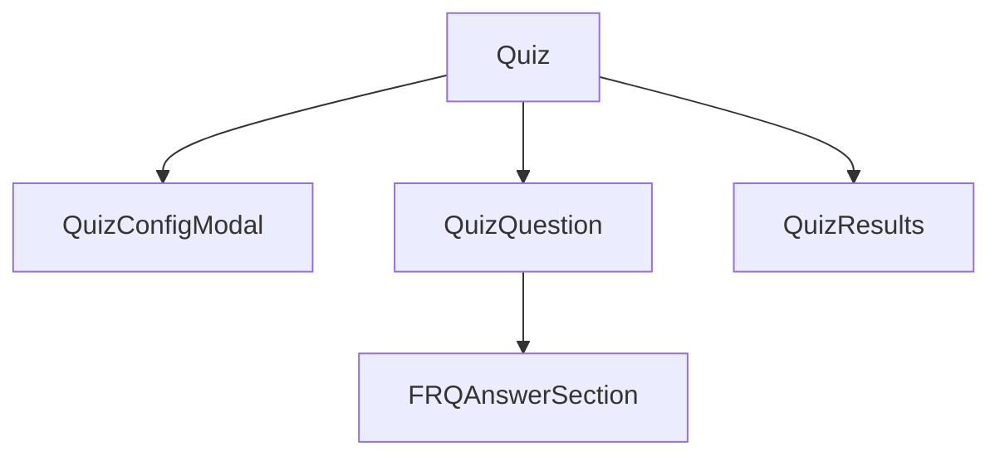
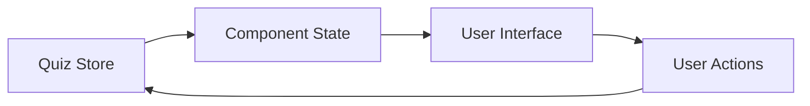

# System Patterns

## Architecture Overview

### Component Structure


### State Management
- Using Zustand for global quiz state
- Key stores:
  - useQuizStore: Manages quiz flow, questions, answers
  - useSettingsStore: User preferences and settings

### Component Patterns

#### Quiz Component
- Root component managing quiz flow
- Controls view state: config, quiz, results
- Handles quiz initialization and completion

#### QuizConfigModal
- Configuration interface for quiz setup
- Manages quiz type and settings
- Progressive disclosure of options
- Persists user preferences

#### QuizQuestion
- Handles both MCQ and FRQ questions
- Keyboard navigation support
- Immediate feedback system
- Animated transitions
- Progress tracking

#### FRQAnswerSection
- Specialized input for free response
- Multiline support
- Keyboard shortcut integration
- Answer validation

### UI/UX Patterns

#### Visual Hierarchy
1. Card-based layouts
2. Gradient backgrounds for primary actions
3. Shadow effects for depth
4. Consistent spacing
5. Button height consistency
   - Primary: h-14
   - Secondary: h-12

#### Interactive Elements
1. Button States:
   - Default: Gradient background for primary
   - Hover: Scale transform (1.02)
   - Active: Scale transform (0.98)
   - Disabled: Muted with reduced opacity
   - Loading: Custom spinner with matching colors

2. Input Fields:
   - Clear focus states
   - Validation feedback
   - Error handling
   - Multiline support where needed

#### Animations
1. Question transitions
2. Feedback reveals
3. Modal interactions
4. Progress updates
5. Button hover/active states
6. Loading states

### Keyboard Navigation
1. MCQ Questions:
   - Numbers 1-4 for options
   - Enter/Space to submit
   - Enter/Space for next

2. FRQ Questions:
   - Enter to submit
   - Shift+Enter for newlines
   - Enter/Space for next

### Data Flow


### Error Handling
1. Input Validation
   - Required fields
   - Format checking
   - Length limits

2. State Validation
   - Question progression
   - Answer submission
   - Quiz completion

### Performance Patterns
1. Component Optimization
   - Memoization where needed
   - Efficient re-renders
   - State updates batching

2. Animation Performance
   - Hardware acceleration
   - Transition optimizations
   - Layout stability

### Accessibility Patterns
1. Keyboard Navigation
2. ARIA labels
3. Focus management
4. Color contrast
5. Screen reader support

## Technical Decisions

### Framework Choices
1. Next.js 14 with App Router
2. TypeScript for type safety
3. Tailwind CSS for styling
4. Framer Motion for animations
5. Zustand for state management

### Code Organization
1. Component Structure:
   ```
   components/
     quiz/
       Quiz.tsx
       QuizQuestion.tsx
       QuizConfigModal.tsx
       QuizResults.tsx
       FRQAnswerSection.tsx
   ```

2. State Management:
   ```
   stores/
     useQuizStore.ts
     useSettingsStore.ts
   ```

3. Types:
   ```
   types/
     quiz.ts
     settings.ts
   ```

### Testing Strategy
1. Unit tests for core logic
2. Integration tests for quiz flow
3. E2E tests for critical paths
4. Accessibility testing

### Future Considerations
1. Performance monitoring
2. Analytics integration
3. Mobile optimization
4. Offline support
5. Multi-language support

## State Management

### Quiz Session Management
1. Session Validation
   ```typescript
   isValidSession: () => {
     return Boolean(
       sessionId && 
       questions.length > 0 &&
       currentQuestionIndex < questions.length &&
       answers && 
       Object.keys(answers).length > 0
     );
   }
   ```

2. Session Persistence
   - Use Zustand persist middleware
   - Persist critical state:
     - Questions and answers
     - Current progress
     - UI state (view, explanations)
   - Clear session on explicit actions

3. Session Recovery
   - Validate session on quiz start
   - Restore UI state with answers
   - Preserve explanation visibility
   - Handle incomplete sessions

### UI/UX Patterns

1. Visual Hierarchy
   - Card-based layouts for content grouping
   - Gradient backgrounds for primary actions
   - Consistent button heights:
     - Primary: h-14
     - Secondary: h-12
   - Visual feedback for states:
     - Correct/incorrect answers
     - Loading states
     - Active states

2. Interactive Elements
   - Button States:
     - Hover: scale(1.02)
     - Active: scale(0.98)
     - Loading: Custom spinner
     - Disabled: Reduced opacity
   - Input Fields:
     - Clear focus states
     - Error highlighting
     - Multiline support where needed
   - Navigation:
     - Consistent back buttons
     - Clear exit points
     - Progress indicators

3. Animations
   - Button hover/active states
   - Loading states
   - View transitions
   - Feedback animations
   - Modal transitions

## Component Architecture

1. Quiz Components
   - QuizConfigModal: Configuration and quiz start
   - QuizQuestion: Question display and interaction
   - QuizResults: Results display and analytics
   - FRQAnswerSection: Free response handling

2. State Flow
   ```
   Config -> Quiz -> Results
      ^        |
      |________|
   (via settings)
   ```

3. Session Flow
   ```
   New Quiz -> Configure -> Start
   Return   -> Validate -> Resume/Reset
   Settings -> Cleanup  -> New Config
   ```

## Data Patterns

1. Quiz State
   - Core state (questions, answers)
   - UI state (view, loading)
   - Progress tracking
   - Session management

2. Persistence Strategy
   - Local storage for session data
   - API endpoints for quiz operations
   - Error handling for network issues

3. Type Safety
   - Strong typing for quiz state
   - Question type discrimination
   - Answer validation

## Error Handling

1. Session Errors
   - Invalid session recovery
   - Network failures
   - State corruption

2. User Feedback
   - Toast notifications
   - Error boundaries
   - Loading states

## Performance Considerations

1. State Updates
   - Batch related changes
   - Minimize persistence payload
   - Optimize re-renders

2. Session Management
   - Clear invalid sessions
   - Handle large answer sets
   - Manage storage limits 