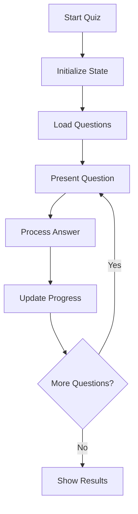

# System Patterns

## Architecture Overview

### Frontend Architecture
```
src/
├── app/             # Next.js app router pages
├── components/      # React components
│   ├── quiz/       # Quiz-related components
│   ├── ui/         # Shared UI components
│   └── layout/     # Layout components
├── stores/         # Zustand state management
├── lib/            # Shared utilities
└── styles/         # Global styles
```

### State Management
- Zustand for global state
- React Query for server state
- Local component state where appropriate

### Key Components
1. **Quiz System**
   - QuizContent: Main quiz interface
   - QuizResults: Results display
   - QuizControls: Navigation controls
   - QuizHeader: Progress display

2. **Store Structure**
   - useQuizStore: Quiz state and logic
   - useSettingsStore: User preferences
   - useProgressStore: Learning progress

## Design Patterns

### Component Patterns
1. **Compound Components**
   - QuizLayout with child components
   - Form components with validation

2. **Custom Hooks**
   - useQuizNavigation
   - useQuizTimer
   - useKeyboardShortcuts

3. **State Management**
   - Centralized stores
   - Action creators
   - Selectors

### Data Flow
1. User Action → Store Update → UI Update
2. API Request → Store Update → UI Update
3. Timer Update → Store Update → UI Update

## Implementation Details

### Quiz Session Flow


### Time Handling
- All times stored in milliseconds
- Conversion to seconds for display
- Server timestamps for session tracking

### Error Handling
1. Boundary Components
2. Store error states
3. Fallback UI components
4. Error logging

## Current Technical Debt
1. Inconsistent time handling
2. Missing error boundaries
3. Incomplete session persistence
4. Settings implementation needed
5. Performance optimization needed 