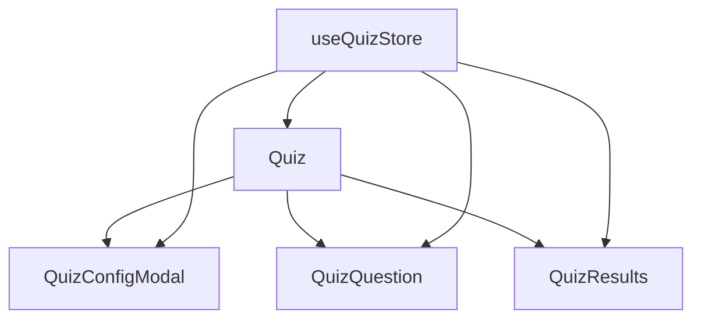
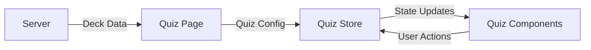
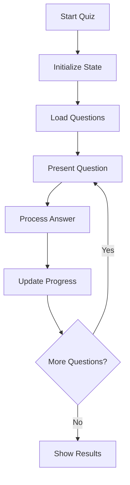

# System Patterns

## Component Architecture

### Quiz System


#### State Flow
1. Quiz Configuration
   - Quiz type selection (mixed, MCQ, FRQ)
   - Question count (fixed at 10)
   - Start quiz action

2. Question Flow
   - Question display
   - Answer submission
   - Immediate feedback
   - Progress tracking

3. Results Display
   - Score calculation
   - Answer review
   - Restart options

### State Management
- Centralized quiz state using Zustand
- View management: config → quiz → results
- Question progression and scoring
- Error handling and loading states

### Data Flow


### Component Patterns
1. **Container Components**
   - Quiz (main container)
   - Page layouts

2. **Presentational Components**
   - QuizConfigModal
   - QuizQuestion
   - QuizResults

3. **State Management**
   - useQuizStore (Zustand)
   - Local component state for UI

### API Integration
1. **Data Fetching**
   - Server-side deck data
   - Question generation (planned)
   - Progress saving (planned)

2. **Error Handling**
   - Toast notifications
   - Graceful fallbacks
   - Loading states

### UI/UX Patterns
1. **Navigation**
   - Linear progression
   - Clear state transitions
   - Immediate feedback

2. **Styling**
   - Tailwind CSS
   - Consistent spacing
   - Responsive design
   - Dark mode support

## Architecture Overview

### Frontend Architecture
```
src/
├── app/             # Next.js app router pages
├── components/      # React components
│   ├── quiz/       # Quiz-related components
│   ├── ui/         # Shared UI components
│   └── layout/     # Layout components
├── stores/         # Zustand state management
├── lib/            # Shared utilities
└── styles/         # Global styles
```

### State Management
- Zustand for global state
- React Query for server state
- Local component state where appropriate

### Key Components
1. **Quiz System**
   - QuizContent: Main quiz interface
   - QuizResults: Results display
   - QuizControls: Navigation controls
   - QuizHeader: Progress display

2. **Store Structure**
   - useQuizStore: Quiz state and logic
   - useSettingsStore: User preferences
   - useProgressStore: Learning progress

## Design Patterns

### Component Patterns
1. **Compound Components**
   - QuizLayout with child components
   - Form components with validation

2. **Custom Hooks**
   - useQuizNavigation
   - useQuizTimer
   - useKeyboardShortcuts

3. **State Management**
   - Centralized stores
   - Action creators
   - Selectors

### Data Flow
1. User Action → Store Update → UI Update
2. API Request → Store Update → UI Update
3. Timer Update → Store Update → UI Update

## Implementation Details

### Quiz Session Flow


### Time Handling
- All times stored in milliseconds
- Conversion to seconds for display
- Server timestamps for session tracking

### Error Handling
1. Boundary Components
2. Store error states
3. Fallback UI components
4. Error logging

## Current Technical Debt
1. Inconsistent time handling
2. Missing error boundaries
3. Incomplete session persistence
4. Settings implementation needed
5. Performance optimization needed 