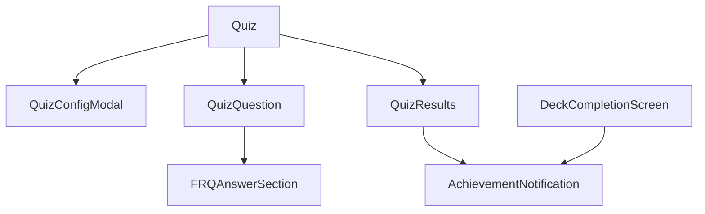

# System Patterns

## Architecture Overview

### Component Structure


### State Management
- Using Zustand for global state
- Key stores:
  - useQuizStore: Manages quiz flow, questions, answers
  - useSettingsStore: User preferences and settings
  - useAchievementStore: Achievements and points tracking

### Component Patterns

#### Quiz Component
- Root component managing quiz flow
- Controls view state: config, quiz, results
- Handles quiz initialization and completion

#### QuizConfigModal
- Configuration interface for quiz setup
- Manages quiz type and settings
- Progressive disclosure of options
- Persists user preferences

#### QuizQuestion
- Handles both MCQ and FRQ questions
- Keyboard navigation support
- Immediate feedback system
- Animated transitions
- Progress tracking

#### FRQAnswerSection
- Specialized input for free response
- Multiline support
- Keyboard shortcut integration
- Answer validation

#### Achievement System
- Achievement tracking and unlocking
- Points calculation and persistence
- Progress monitoring
- Notification system

#### AchievementNotification
- Toast-style notifications
- Badge display
- Points earned
- Animation system

### Database Schema

#### Achievements Table
```sql
CREATE TABLE achievements (
  id SERIAL PRIMARY KEY,
  name VARCHAR(255) NOT NULL,
  description TEXT,
  badge_icon VARCHAR(255),
  points_required INTEGER,
  type VARCHAR(50)
);
```

#### User Achievements
```sql
CREATE TABLE user_achievements (
  user_id INTEGER REFERENCES users(id),
  achievement_id INTEGER REFERENCES achievements(id),
  unlocked_at TIMESTAMP DEFAULT CURRENT_TIMESTAMP,
  PRIMARY KEY (user_id, achievement_id)
);
```

### Achievement Types
1. Quiz Achievements
   - Quiz Novice: First quiz completion
   - Quiz Master: 100% on 5 quizzes
   - Perfect Streak: 10 correct in a row

2. Study Achievements
   - Study Starter: First deck review
   - Dedicated Learner: 100 cards reviewed
   - Consistency: 3-day streak

3. Progress Achievements
   - Weekly Warrior: 7-day streak
   - Monthly Master: 30-day streak
   - Knowledge Seeker: 10 decks
   - Master of Many: 1000 points

### Points System
1. Quiz Points
   - Based on accuracy
   - Bonus for streaks
   - Time factor consideration

2. Flashcard Points
   - Based on SRS difficulty
   - Streak multipliers
   - Session completion bonus

### API Endpoints
1. Achievement Routes
   ```typescript
   POST /api/achievements/check
   GET /api/achievements/user
   POST /api/achievements/unlock
   ```

2. Points Routes
   ```typescript
   POST /api/points/update
   GET /api/points/history
   GET /api/points/stats
   ```

### UI/UX Patterns

#### Visual Hierarchy
1. Card-based layouts
2. Gradient backgrounds for primary actions
3. Shadow effects for depth
4. Consistent spacing
5. Button height consistency
   - Primary: h-14
   - Secondary: h-12

#### Interactive Elements
1. Button States:
   - Default: Gradient background for primary
   - Hover: Scale transform (1.02)
   - Active: Scale transform (0.98)
   - Disabled: Muted with reduced opacity
   - Loading: Custom spinner with matching colors

2. Input Fields:
   - Clear focus states
   - Validation feedback
   - Error handling
   - Multiline support where needed

#### Animations
1. Question transitions
2. Feedback reveals
3. Modal interactions
4. Progress updates
5. Button hover/active states
6. Loading states

#### Achievement Display
1. Notification System
   - Toast notifications
   - Badge preview
   - Points earned
   - Unlock animation

2. Profile Display
   - Achievement grid
   - Progress tracking
   - Points history
   - Stats overview

#### Visual Elements
1. Badge Design
   - Neural theme
   - Gradient effects
   - SVG animations
   - Level indicators

2. Progress Indicators
   - Points counter
   - Achievement progress
   - Streak tracking
   - Level system

### Keyboard Navigation
1. MCQ Questions:
   - Numbers 1-4 for options
   - Enter/Space to submit
   - Enter/Space for next

2. FRQ Questions:
   - Enter to submit
   - Shift+Enter for newlines
   - Enter/Space for next

### Data Flow


### Error Handling
1. Input Validation
   - Required fields
   - Format checking
   - Length limits

2. State Validation
   - Question progression
   - Answer submission
   - Quiz completion

3. Achievement Validation
   - Duplicate checks
   - Progress verification
   - Points validation

4. Points Tracking
   - Calculation accuracy
   - History tracking
   - Streak validation

### Performance Patterns
1. Component Optimization
   - Memoization where needed
   - Efficient re-renders
   - State updates batching

2. Animation Performance
   - Hardware acceleration
   - Transition optimizations
   - Layout stability

3. Achievement Checks
   - Batch processing
   - Caching strategies
   - Efficient queries

4. Points Updates
   - Atomic operations
   - Transaction handling
   - Cache invalidation

### Accessibility Patterns
1. Keyboard Navigation
2. ARIA labels
3. Focus management
4. Color contrast
5. Screen reader support

## Technical Decisions

### Framework Choices
1. Next.js 14 with App Router
2. TypeScript for type safety
3. Tailwind CSS for styling
4. Framer Motion for animations
5. Zustand for state management

### Code Organization
1. Component Structure:
   ```
   components/
     quiz/
       Quiz.tsx
       QuizQuestion.tsx
       QuizConfigModal.tsx
       QuizResults.tsx
       FRQAnswerSection.tsx
   ```

2. State Management:
   ```
   stores/
     useQuizStore.ts
     useSettingsStore.ts
     useAchievementStore.ts
   ```

3. Types:
   ```
   types/
     quiz.ts
     settings.ts
   ```

### Testing Strategy
1. Unit tests for core logic
2. Integration tests for quiz flow
3. E2E tests for critical paths
4. Accessibility testing

### Future Considerations
1. Performance monitoring
2. Analytics integration
3. Mobile optimization
4. Offline support
5. Multi-language support

## State Management

### Quiz Session Management
1. Session Validation
   ```typescript
   isValidSession: () => {
     return Boolean(
       sessionId && 
       questions.length > 0 &&
       currentQuestionIndex < questions.length &&
       answers && 
       Object.keys(answers).length > 0
     );
   }
   ```

2. Session Persistence
   - Use Zustand persist middleware
   - Persist critical state:
     - Questions and answers
     - Current progress
     - UI state (view, explanations)
   - Clear session on explicit actions

3. Session Recovery
   - Validate session on quiz start
   - Restore UI state with answers
   - Preserve explanation visibility
   - Handle incomplete sessions

### UI/UX Patterns

1. Visual Hierarchy
   - Card-based layouts for content grouping
   - Gradient backgrounds for primary actions
   - Consistent button heights:
     - Primary: h-14
     - Secondary: h-12
   - Visual feedback for states:
     - Correct/incorrect answers
     - Loading states
     - Active states

2. Interactive Elements
   - Button States:
     - Hover: scale(1.02)
     - Active: scale(0.98)
     - Loading: Custom spinner
     - Disabled: Reduced opacity
   - Input Fields:
     - Clear focus states
     - Error highlighting
     - Multiline support where needed
   - Navigation:
     - Consistent back buttons
     - Clear exit points
     - Progress indicators

3. Animations
   - Button hover/active states
   - Loading states
   - View transitions
   - Feedback animations
   - Modal transitions

## Component Architecture

1. Quiz Components
   - QuizConfigModal: Configuration and quiz start
   - QuizQuestion: Question display and interaction
   - QuizResults: Results display and analytics
   - FRQAnswerSection: Free response handling

2. State Flow
   ```
   Config -> Quiz -> Results
      ^        |
      |________|
   (via settings)
   ```

3. Session Flow
   ```
   New Quiz -> Configure -> Start
   Return   -> Validate -> Resume/Reset
   Settings -> Cleanup  -> New Config
   ```

## Data Patterns

1. Quiz State
   - Core state (questions, answers)
   - UI state (view, loading)
   - Progress tracking
   - Session management

2. Persistence Strategy
   - Local storage for session data
   - API endpoints for quiz operations
   - Error handling for network issues

3. Type Safety
   - Strong typing for quiz state
   - Question type discrimination
   - Answer validation

## Error Handling

1. Session Errors
   - Invalid session recovery
   - Network failures
   - State corruption

2. User Feedback
   - Toast notifications
   - Error boundaries
   - Loading states

## Performance Considerations

1. State Updates
   - Batch related changes
   - Minimize persistence payload
   - Optimize re-renders

2. Session Management
   - Clear invalid sessions
   - Handle large answer sets
   - Manage storage limits

3. Achievement Checks
   - Batch processing
   - Caching strategies
   - Efficient queries

4. Points Updates
   - Atomic operations
   - Transaction handling
   - Cache invalidation

## Technical Implementation

### Achievement Check Flow


### Points Calculation
```typescript
interface PointsCalculation {
  quiz: {
    accuracy: number;
    streak: number;
    timeBonus: number;
  };
  flashcard: {
    difficulty: Difficulty;
    streak: number;
    sessionBonus: number;
  };
}
```

## Future Considerations

1. Social Features
   - Achievement sharing
   - Leaderboards
   - Community challenges

2. Analytics
   - Achievement stats
   - User progress
   - Engagement metrics

3. Expansion
   - New achievement types
   - Custom badges
   - Special events 

## Achievement System Architecture
- Achievement data model:
  ```typescript
  interface Achievement {
    id: string;
    name: string;
    description: string;
    icon: string;
    category: string;
    requirements: {
      type: string;
      value: number;
    };
    unlocked: boolean;
    progress: number;
  }
  ```
- Categories: study, mastery, streak, points
- Progress tracking per achievement
- Unlocking logic based on user actions
- API endpoints:
  - GET /api/achievements - Fetch all achievements and user progress
  - POST /api/achievements/check - Check and update achievement progress

## Component Architecture
- GlobalAchievements: Main achievement display component
- AchievementGrid: Reusable grid layout for achievements
- Achievement progress indicators and unlock animations
- Integration with user authentication (Clerk)

## Database Schema
- Achievement model in Prisma
- UserAchievement junction table for tracking unlocked achievements
- Progress tracking fields in UserProgress model

## State Management
- Achievement data fetched and managed in components
- User authentication state via Clerk
- Progress tracking through API endpoints

## API Structure
- RESTful endpoints for achievement management
- Achievement check middleware for tracking progress
- User authentication middleware for protected routes

## UI/UX Patterns
- Achievement cards with progress indicators
- Category-based filtering
- Loading states with skeleton UI
- Responsive grid layout
- Achievement unlock animations

## Error Handling
- API error states
- Loading states
- Fallback UI for missing data
- Authentication error handling

## Testing Strategy
- Unit tests for achievement logic
- Integration tests for API endpoints
- E2E tests for achievement unlocking flow

## Security
- User authentication required for achievement endpoints
- Achievement verification server-side
- Protected routes and API endpoints 

## UI Architecture

### Component Organization
- Modular components with clear separation of concerns
- Shared UI components in `@/components/ui`
- Feature-specific components in dedicated directories
- Consistent use of shadcn/ui components

### State Management
- React hooks for local state
- Context providers for global state
- Clerk for authentication state
- Progress tracking via API endpoints

### Layout Patterns
- Responsive grid systems
- Card-based content organization
- Tabbed interfaces for related content
- Motion animations for enhanced UX

## Key Design Patterns

### Progress Tracking
```typescript
interface StudyProgress {
  cardsReviewed: number;
  totalCards: number;
  masteryLevel: number;
  minutesStudied: number;
  studySessions: number;
  currentStreak: number;
  weeklyActivity: number[];
  recentMastery: { date: string; mastery: number }[];
  totalPoints: number;
}
```

### Achievement System
- Global achievements tracking
- Progress-based unlocking
- Category-based organization
- Visual feedback system

### UI Components
1. Cards
   - Consistent styling with primary/10 borders
   - Backdrop blur effects
   - Motion animations
   - Responsive layouts

2. Tabs
   - Grid-based tab lists
   - Animated content transitions
   - Clear visual hierarchy
   - Content-specific layouts

3. Progress Indicators
   - Animated progress bars
   - Weekly activity charts
   - Stats cards with icons
   - Dynamic updates

## Implementation Paths

### Progress Display
1. Fetch progress data
2. Update UI components
3. Handle loading states
4. Animate transitions

### Achievement Integration
1. Load achievements data
2. Display in grid layout
3. Track progress
4. Update unlocked status

### Combined Features
1. Unified card container
2. Tabbed navigation
3. Shared state management
4. Consistent styling

## Critical Flows

### Progress Tracking


### Achievement System


## Component Relationships
- Main page contains progress card
- Progress card contains tabs
- Tabs manage progress and achievements
- Shared state between components
- Consistent styling throughout 